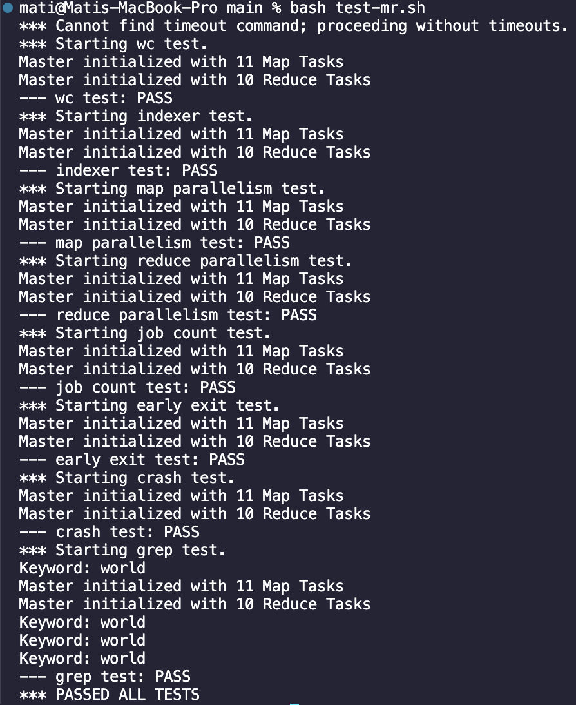
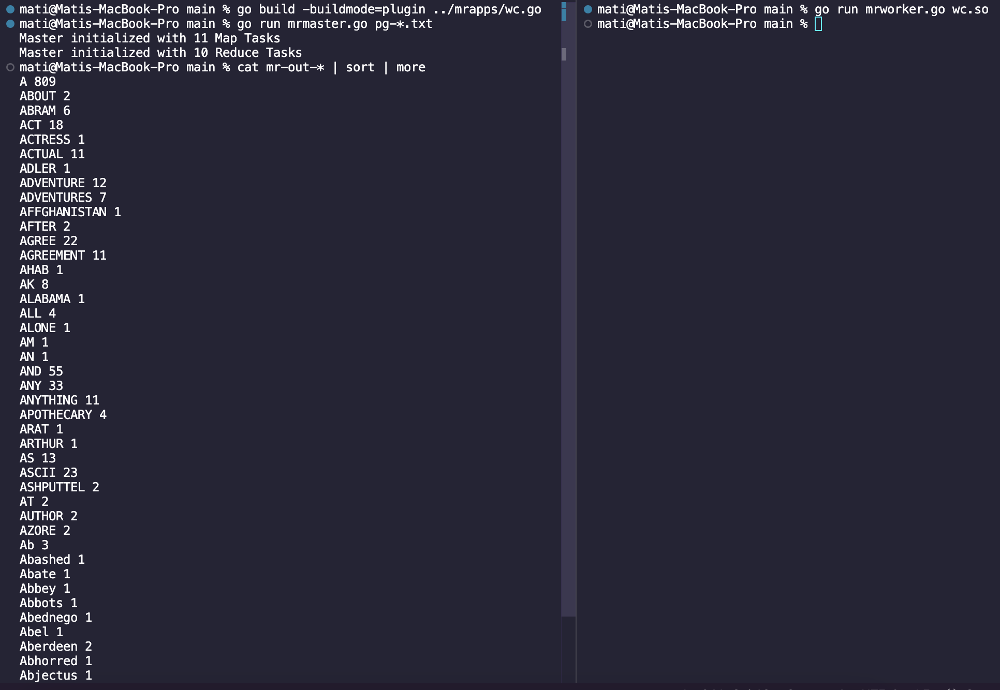
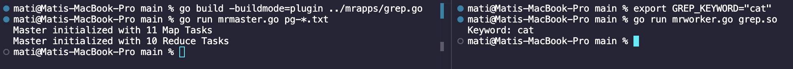
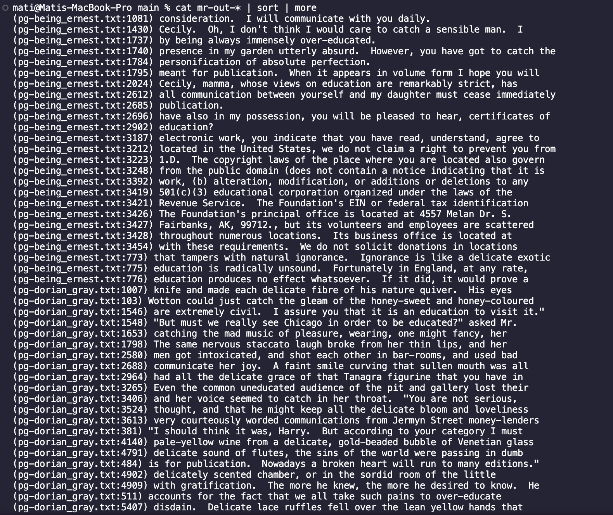

# Distributed MapReduce Implementation

## Overview

This implementation follows Section 3 ("Implementation") of Google's MapReduce paper to create a distributed data processing framework that enables parallel computation across multiple machines while handling failures transparently (we notably exclude the locality optimizations described in Section 3.4, as our focus was on the fundamental distributed processing architecture.). This implementation includes a master process that manages task distribution and multiple worker processes that perform the map and reduce operations. Developers can write simple map and reduce functions while the framework handles the complexities of distribution, parallelization, and fault tolerance.

### Features

- Distributed task processing with coordinator-worker architecture
- Fault tolerance with automatic task reassignment
- Support for custom map and reduce functions through plugins
- Parallel execution of map and reduce tasks
- Automatic handling of intermediate results
- Worker failure detection and recovery

### Requirements

- Go 1.17 or higher
- Unix-like operating system (Linux/MacOS)
- Network connectivity for RPC communication

### Project Structure

```
src/
├── mr/
│   ├── coordinator.go   # Coordinator implementation
│   ├── worker.go       # Worker implementation
│   └── rpc.go         # RPC definitions
├── mrapps/
│   ├── wc.go          # Word count example
│   ├── grep.go        # Text search implementation
│   └── indexer.go     # Indexing example
└── main/
    ├── mrcoordinator.go # Coordinator entry point
    ├── mrworker.go     # Worker entry point
    └── mrsequential.go # Sequential version for testing
```

### Commands to Run Individual MapReduce Applications

Running our different MapReduce Applications. First make sure you are in the `~/src/main` directory: `cd ~/src/main`
We have provided 11 different books as pg-\*.txt files following the structure to model large input files. We have also provided 3 production style applications: wc.go (word count), indexer.go (document indexing), grep.go (text search).

#### 1. WordCount Application (wc.go)

A word count application that splits text into words and counts their occurrences.

1. Build the wc.go plugin:
   `go build -buildmode=plugin ../mrapps/wc.go`

   This compiles the word count (wc.go) program into a shared object (.so) file that can be dynamically loaded at runtime by our MapReduce system.

2. Clean up any previous output:
   `rm mr-out*`

3. Run the Master node program:
   `go run mrmaster.go pg-*.txt`

4. In separate terminal windows, start one or more workers:
   `go run mrworker.go wc.so`

5. Observe the output with:
   `cat mr-out-* | sort | more`

---

#### 2. Document Indexing Application (indexer.go) 

An indexing application that creates an index of words and their document locations

1. Build the indexer.go plugin:
   `go build -buildmode=plugin ../mrapps/indexer.go`

2. Clean up any previous output:
   `rm mr-out*`

   To clean up intermediate files as well: `rm mr-*`

3. Run the Master node program:
   `go run mrmaster.go pg-*.txt`

4. In separate terminal windows, start one or more workers:
   `go run mrworker.go indexer.so`

5. Observe the output with:
   `cat mr-out-* | sort | more`

---

#### 3. Grep Application (grep.go)

A text search application that finds lines containing a specified keyword. (default keyword set to **"world"**)

1. Set the keyword by setting the enviroment variable `GREP_KEYWORD`.

   `export GREP_KEYWORD="{your keyword here}"`

   Check if keyword was set with: `echo $GREP_KEYWORD`.

2. Build the indexer.go plugin:
   `go build -buildmode=plugin ../mrapps/grep.go`

3. Clean up any previous output:
   `rm mr-out*`

   To clean up intermediate files as well: `rm mr-*`

4. Run the Master node program:
   `go run mrmaster.go pg-*.txt`

5. In separate terminal windows, start one or more workers:
   `go run mrworker.go grep.so`

6. Observe the output with:
   `cat mr-out-* | sort | more`

---

#### 4. Running Unittests/Verification Applications

In addition to 3 production-style applications, we have 6 testing/verification applications: mtiming.go (map parallelism), rtiming.go (reduce parallelism), jobcount.go (task assignment), crash.go (fault tolerance), nocrash.go (fault tolerance baseline), early_exit.go (worker behavior).

We have provided a bash script, that 1) runs these testing applications and 2) performs unittests for our MapReduce implemention by comparing our output to the correct output of `wc.go`, `indexer.go`, and `grep.go` (correct output is from the provided sequential MapReduce implementation from the MIT source code).

To run the bash script, make sure you are in the `src/main` directory and run:

`bash ./test-mr.sh`

---

### MapReduce Demonstration/Screenshots






### Group Work

#### Team Member Contributions:

**Alex Shin**:

**Mati Hassan**:
